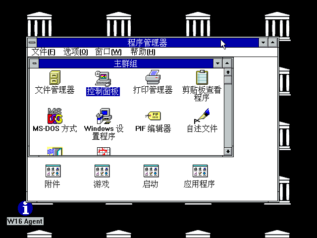
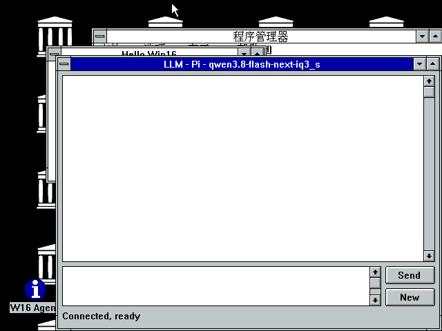
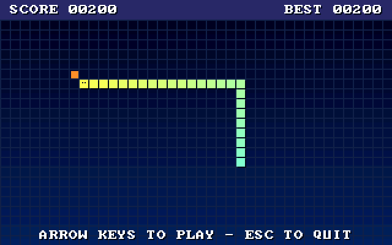
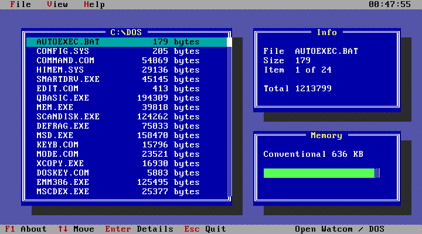

# retro-win3x — Windows 3.x / DOS cross-development on Linux and macOS

Cross-compile Win16 and DOS programs on Linux or macOS with Open Watcom, run them in
Windows 3.2 (Simplified Chinese) or Windows 3.1 under QEMU, and talk to the
guest over serial lines: a control agent, file transfer, and a chat window
connected to a local LLM coding agent ([pi](https://github.com/badlogic/pi-mono)).

 
 

## Layout
| Path | Contents |
|---|---|
| `vm/run.sh` | Start the VM: `vm/run.sh` (Simplified Chinese Windows 3.2) or `vm/run.sh win31` (English Windows 3.1) |
| `vm/build-images.sh` | Download the original disks from archive.org and build the images in `vm/images/` (agent, restart loop, etc. preinstalled) |
| `vm/images/` | Base disk images (not in the repo; built by `build-images.sh`; never written at runtime) |
| `vm/disks/` | This machine's working disks (not in the repo): created on first run as overlays on the base images; delete one to reset that VM |
| `vm/tools/mon.sh` | QEMU monitor helpers (`mon`, `typ`, `shot`) for debugging |
| `bin/` | Host commands: `w31x` `w16ctl` `w16run` `dosrun` `w16new` `w16chatd` `setup-watcom` |
| `win16dev/` | Win16: shared rules `w16.mk`, `template/`, examples `hello/`, `demo/` and `clock/` (a Chinese-UI clock written by pi through the chat window), LLM chat window `chat/`, in-VM agent `tools/w16agent`, `tools/exitwin` |
| `dosdev/` | DOS: shared rules `dos.mk`, `tui/` text-mode UI demo (16-bit), `snake/` 320×200 snake game (32-bit DOS/4GW) |
| `docs/` | Screenshots |

## Setup
```bash
sudo pacman -S qemu-desktop mtools socat imagemagick    # or your distro's packages
bin/setup-watcom                                       # Open Watcom v2 -> ~/opt/watcom
vm/build-images.sh                                     # download (~30 MB) and build the disk images
# scripts and Makefiles expect these paths; symlink them to the repo:
ln -s "$PWD/vm" ~/win31; ln -s "$PWD/win16dev" ~/win16dev; ln -s "$PWD/dosdev" ~/dosdev
for f in bin/*; do ln -s "$PWD/$f" ~/.local/bin/; done
vm/run.sh
```
On macOS (Intel or Apple Silicon), install the tools with Homebrew instead:
```bash
brew install qemu mtools socat imagemagick bash
```
The scripts need bash 4+ (`/bin/bash` on macOS is 3.2), so make sure Homebrew's `bash` comes first
in `PATH`. Also make sure `~/.local/bin` is in `PATH`. `vm/run.sh` uses QEMU's Cocoa display on macOS.

The chat window also needs the [pi](https://github.com/badlogic/pi-mono) coding agent installed locally.

**No operating system images are included in this repository.** `build-images.sh` downloads them from
archive.org: a preinstalled English Windows 3.1 + MS-DOS 6.22 disk (`win31vhd`) and an installed
Simplified Chinese Windows 3.2 directory (`win32c`). These are still-copyrighted commercial products;
only download them if you are entitled to use them.

## Commands (`bin/`)
| Command | What it does |
|---|---|
| `w16new NAME` | New Win16 project from the template → `win16dev/NAME` |
| `make` / `make run` | Build / build + copy into the VM + run + screenshot (same for Win16 and DOS projects) |
| `w16run X.EXE` | Run a Win16 program (closes the old instance first), screenshot to `w16run.png` |
| `dosrun X.EXE` | Run a DOS program (full screen), screenshot to `dosrun.png`, then send Esc; `-k` keeps it running, `-q "esc y"` sets the quit keys |
| `w31x put/get/ls/rm/wipe` | Exchange files through floppy drive A: |
| `w16ctl CMD` | Send a command to the agent: PING TASKS RUN EXEC CLOSE COPY INI EXIT RESTART UPDATE VERSION |
| `w16ctl put/get/ls/rm/mkdir` | Exchange files with Windows over the serial line (no floppy) |
| `setup-watcom` | Download Open Watcom v2 |

## How it works
- Drive A: is a floppy image. `w31x` ejects it through the QEMU monitor, edits it with mtools, and
  inserts it again, so Linux and DOS never write it at the same time.
- COM1 is connected to `vm/com1.sock`. `W16AGENT.EXE` (started from `WIN.INI` `load=`) takes commands
  there and answers `OK`/`ERR`.
- `AUTOEXEC.BAT` ends with a loop, so `RESTART`/`UPDATE` can exit Windows, swap in a new agent,
  and start Windows again.
- Programs are copied to `C:\W16RUN` before running: Win16 programs load code segments from their EXE
  on demand, and DOS programs reading the floppy hit Windows' DMA buffer limit.

## DOS targets
- `TARGET = dos16`: 16-bit real mode (wcc, small model)
- `TARGET = dos32`: 32-bit protected mode, DOS/4GW (wcc386); `DOS4GW.EXE` is copied along automatically

## Chinese
- **The default VM is Simplified Chinese Windows 3.2**, with SimSun/SimHei fonts and the Quanpin,
  Intelligent ABC and Wubi input methods. Ctrl+Space toggles the input method, Ctrl+Shift switches
  between them. Input methods do nothing while Caps Lock is on.
- Chinese platforms can optionally be added to the English 3.1 disk by hand (`build-images.sh` does not do this):
  - **RichWin 97** (Windows; archive.org `RichWin97`): copy the `RW97PRO` directory to drive C:, run
    `SETUP.EXE` and do a full install to `C:\RW97PRO`, then make it start with Windows:
    `w16ctl INI WIN.INI windows load 'C:\RW97PRO\RICHWIN.EXE C:\W16RUN\W16AGENT.EXE'`.
    Alt+2 pinyin, Alt+4 Wubi, Alt+5 English–Chinese, Alt+1 code input, Alt+0 back to English,
    Alt+\ toggles Chinese/Western punctuation. Pick characters with the digit keys, page with `=`/`-`.
  - **UCDOS 7.0** (plain DOS; archive.org `ucdos7`): copy the `UCDOS` directory from its disk image to
    `C:\UCDOS` and run `C:\UCDOS\UCDOS` from DOS (a `[MENU]` boot menu in `CONFIG.SYS` makes this easy).
- Text files must be GB2312/GBK: `iconv -f utf-8 -t gbk a.txt > A.TXT && w16ctl put A.TXT`
- Serial file transfer: `w16ctl put/get/ls/rm/mkdir` (put ~20 KB/s, get ~4 KB/s)

## LLM chat window (`CHAT.EXE`)
- Source in `win16dev/chat/`; `make run` copies it into the VM and starts it.
- Path: `CHAT.EXE` ⇄ COM2 ⇄ `vm/com2.sock` ⇄ `w16chatd` ⇄ `pi -p --mode json --session-id <conversation>`.
- `run.sh` starts `w16chatd` in the background (log: `vm/w16chatd.log`); pi runs in `~/w16chat`.
  Other directory or pi options: `w16chatd --cwd DIR -- --model xxx --no-tools`.
- The title shows `LLM - <agent> - <model> [current/total]`. The left pane lists sessions; select one
  to switch and restore its transcript. New starts a session. Sessions are kept for the current
  `w16chatd` run. Enter sends; Ctrl+Enter inserts a line break; the Send button becomes Stop while
  replying. Right-click the transcript or input box for Copy/Paste.
- Protocol (one command per line, payload = base64 of GBK text): Windows → Linux `HELLO` / `MSG` /
  `NEW` / `SWITCH <index>` / `STOP`; Linux → Windows `B` (reply begins), `T` (text), `C` (clear),
  `L` (session names), `E` (reply ends), `S` (status line), `X` (error), `I` (`agent|model`) and
  `V` (`current/total`).

Note: pi can run commands and edit files on the host (in its working directory). Use
`w16chatd -- --no-tools` for chat only.

## Chinese source files
Put `GBK = 1` in a Win16 project's Makefile to write Chinese text in UTF-8 source files: they are
converted to GBK before compiling, and wcc/wrc get `-zk1` (Chinese double-byte support, so a GBK
trail byte of 0x5C is not taken as a backslash). See `win16dev/hello/`.
